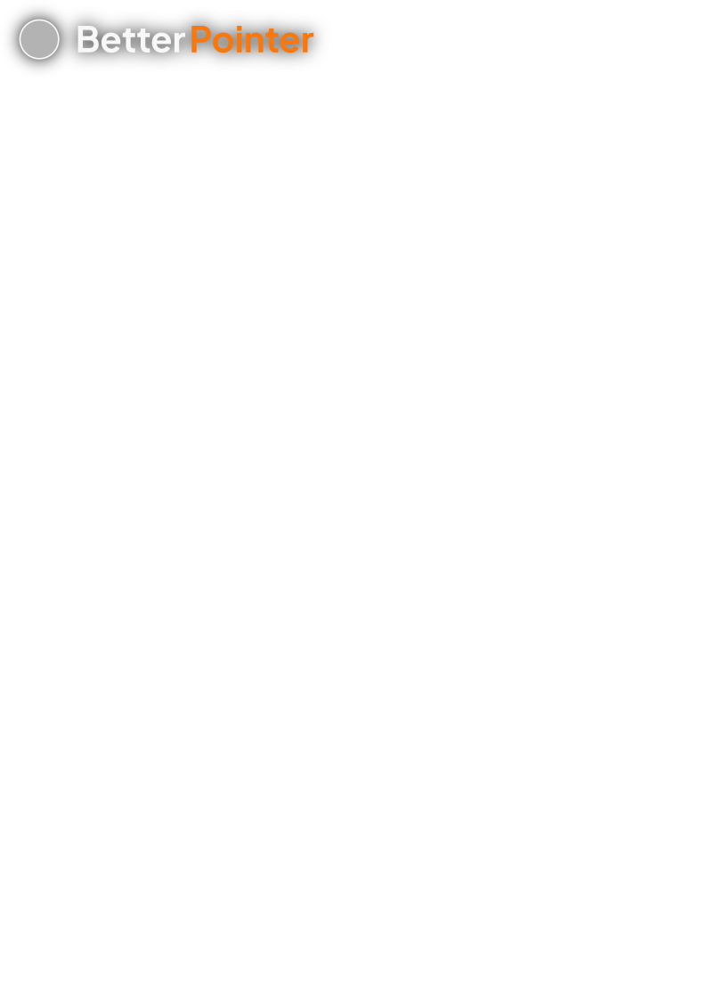

<div align="center" style="margin-top:1rem; font-family: Poppins">
    <a href="https://deepfusion.org" style="display:flex; justify-content:center; height:fit-content; padding:0; text-decoration:none; margin:0 0 0 0">
        </img>
    </a>
    <h3 style="font-family:Montserrat; font-weight:400; font-size:1.3rem; margin:0 0 1.5rem 0">Haha, cool cursor go brrrr...</h3>


[]()
[](https://github.com/LemonOrangeWasTaken/BetterPointer/blob/master/LICENSE)
[](https://github.com/LemonOrangeWasTaken/BetterPointer/stargazers)
</div>

<details open="open">
    <summary>Table of Content</summary>
    <ol>
        <li>
            <a href="#about">What is this?</a>
        </li>
        <li><a href="#getting-started">Installation & Setup</a></li>
            <ul>
                <li><a href="#install">Installation</a></li>
                <li><a href="#setup">Setup</a></li>
            </ul>
        <li><a href="#usage">Usage</a></li>
            <ul>
                <li><a href="#controls">Cursor controls</a></li>
                <li><a href="#eleset">Element settings</a></li>
            </ul>
        <li><a href="#issues">Known issues</a></li>
        <li><a href="#troubleshoot">Troubleshooting</a></li>
        <li><a href="#contributing">Contributing</a></li>
        <li><a href="#license">License</a></li>
    </ol>

</details>

<br>

<h1 id="about">What is this?</h1>

BetterPointer is a JS/TS package that simulates adaptive precision on a webpage with the intention of making buttons and other elements on a website/webapp easier to interact with.

It was largely inspired by the ipadOS cursor, but is implemented in such a way that allows for greater visual and behavioral customization.

You can try the pointer out at: https://lemonorangewastaken.github.io/BetterPointer/

<br>

<h1 id="getting-started">Getting Started</h1>

This section will cover what you need to setup and start using your cursor.

<h2 id="install">Installation</h2>

> ***Note**: if you are using JS without NPM, a cdn accessible `min.js` file is not yet avaiable, but should hopefully be soon.*

This package is available on NPM, and currently supports TS and JS. To install, setup an npm project by running:
```bash
npm init -y
```
Then, install the package by running
```bash
npm i betterpointer
```
**Please note**: this package only works with frontend JS/TS, and will not work on NodeJS/TS. If you need instructions on how to setup npm libraries for frontend JS, please read [this article](https://fredriccliver.medium.com/how-can-i-use-an-npm-module-in-front-end-javascript-63d54d53c005).

<h2 id="getting-started">Setup</h2>
To setup the cursor in your project, create an empty div under the body tag of your HTML file, and give it a unique id. Ex:

```html
<body>
    <div id="some-unique-id"></div>
    <!-- rest of your document... -->
</body>
```

Make sure that there are no styles applied to this div, either in the inline HTML or in a linked CSS sheet.

In your JS/TS file, import the package:

```ts
import cursor from "betterCursor";
```

Then, create an instance of the cursor. This is what will be used to control your cursor, such as toggling light and dark mode.

```ts
const myCursor = new cursor("some-unique-id");
```

You may also pass in a configuration object, like so:

```ts
const config = {
    size : "50px",
    mass : 125
};

const myCursor = new cursor("some-unique-id", config);
```

#### Configurable parameters:
| Key | Default | Units | Descritpion |
| :---: | :---: | :---: | :--- |
| size | "24px" | - | The default size of the cursor. |
| mass | 75 | - | How "heavy" the cursor feels. |
| trackingPeriod | 50 | ms | The period in which the cursor will check for elements to snap on to. |

<h1 id="usage">Usage</h1>

This section will cover how to utilize your cursor to its full potential.

<h2 id="controls">Cursor controls</h2>

These are functions that you can use to control the cursor's appearance and behavior.

<br>

#### Setting the cursor's dark/light appearance

If your site contains a toggleable dark theme or you need to forcibly change the light/dark appearance of your cursor, you may use these two functions to do so:

```ts
myCursor.setDark();   // make the cursor visible in dark theme
myCursor.setLight();  // make the cursor visible in light theme
```

**Note**: `setDark()` will set the cursor to a translucent white color and is meant to be used in a dark themed environment. It does **not**  make the cursor itself dark! The same logic applied to `setLight()` as well.

---

#### Forcibly morphing/snapping the cursor

*Doing this is not reccomended*, as it is still in development and can act buggy. But if, for whatever reason, you need to morph/snap the cursor to an element, you may use this command to do so:
```ts
// morph the cursor into text mode,
// and apply this effect in reference of myElmnt
setShape("text", myElmnt, false, 15);
```
Here's what each of the parameter means (in order):
| Name | Type | Optional | Default | Descritpion |
| :---: | :---: | :---: | :---: | :--- |
| shape | String | ❌ | - | Shape that the cursor should morph to |
| elmnt | HTMLElement | ✅ | currentHoveringElmnt | The reference element (to get parameters such as size and line height from) |
| hideCursor | Boolean | ✅ | false | Whether or not to hide the cursor |
| snapCoef | Number | ✅ | 10 | The larger the number is, the more the element will stick to the cursor.|

All the shapes that are available (if the shape doesn't match any in this table, the cursor will just return to normal):

| Shape | Description |
| :---: | :--- |
| Text | Morph your cursor into a text selection shape, with height matching the line height |
| input | Similar to the text selection, except there will be a bit of Y snapping in the text input box |
| button | Complete snap onto an element in the X and Y direction |

<h2 id="eleset">Element Settings</h2>

Your cursor will only morph/snap onto elements you specified. So if you have a button but didn't specify for the cursor to snap onto it, it will be ignored as a normal element.

BetterPointer uses custom HTML attributes to identify target elements. Some examples are provided below:
```html
<!-- Morph the cursor into text selection mode -->
<p snaptext> Lorem ipsum dolor sit amet... </p>

<!-- Snap the cursor onto a button -->
<button snapbutton> Click Me! </button>
```

Some of attributes available to configure cursor snap target:
| Attributes | Snap To Elmnt | Description |
| :---: | :---: |:--- |
| snaptext | ❌ | morphs the cursor into the text's shape. |
| snapinput | ✅ | snaps the cursor into the input box. |
| snapbutton | ✅ | snaps the cursor to the shape of the button (works on different elements too). |
| bigsnapbutton | ✅ | Same as `snapbutton`, but hides the cursor and is more sticky. |

Some of the attributes available to configure cursor behavior:
| Attributes | Example | Description |
| :---: | :---: |:--- |
| growth | "10px" | Enlarges the cursor by specified amount (Ex: 10px). |


**Note**: in `snapbutton` and `bigsnapbutton` mode, the cursor will morph to the element's bounding box width, height, and corner radius. It is advised to add some padding and corner radius to your elements for an optimal snapping effect.

<h1 id="issues">Known issues</h1>

Here are some known issues about the library so far:

1. Safari absolutely refuses to work with the web (as well as Internet Explorer).
2. Does not work well with transitioning elements
3. Random errors in the console sometimes

<h1 id="troubleshoot">Troubleshooting</h1>

If your cursor does not show up, please check if there is any elements overlaid on top of it that has a z-index over 999999. If there is some other errors, please file an issue report [here](https://github.com/LemonOrangeWasTaken/BetterPointer/issues), or make a [pull request](https://github.com/LemonOrangeWasTaken/BetterPointer/pulls).

<h1 id="contributing">Contributing</h1>

You can't yet, but if you would like to work on it for some reason, please contact me at lemon@thelemonorange.com

<h1 id="license">License</h1>

BetterPointer is licensed under the GPL-3.0 license, please respect it.